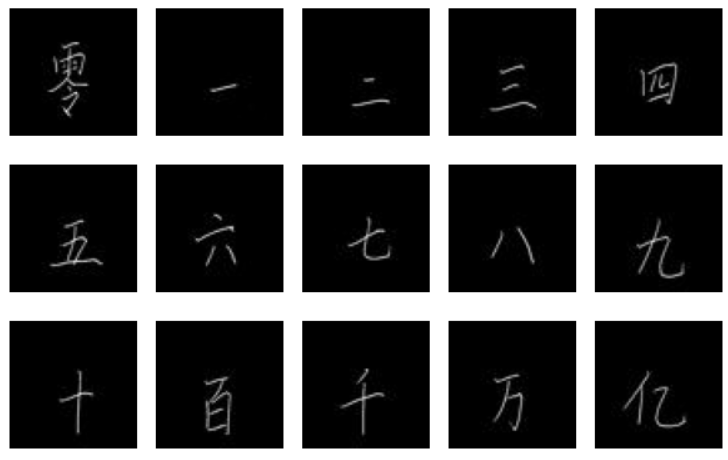
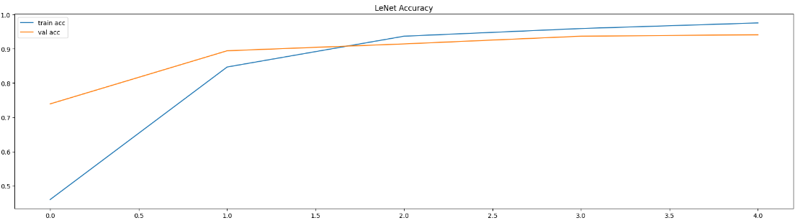
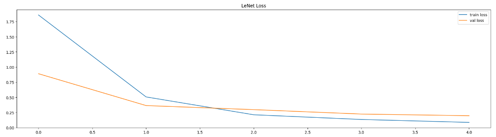
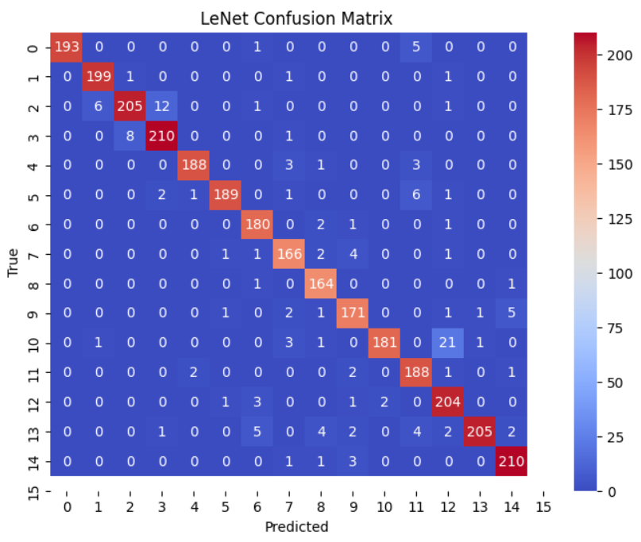
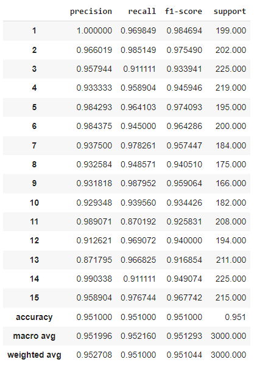

# 🧠 Chinese MNIST Digit Classification with LeNet-5 (TensorFlow)

This project implements the classical **LeNet-5 Convolutional Neural Network (CNN)** architecture for handwritten digit classification using the [Chinese MNIST dataset](https://www.kaggle.com/datasets/gpreda/chinese-mnist). The goal is to explore how traditional CNNs perform on a visually complex and non-Latin script digit dataset.

## 📌 Model Overview

The project uses an adapted **LeNet-5** model capable of processing 64×64 RGB images. It includes:

- Two convolutional + pooling layers
- Fully connected classification layers
- Categorical cross-entropy loss and Adam optimizer

## 🧪 Dataset

- **15 classes** representing Chinese digits
- **15,000 RGB images**, each 64×64 pixels
- Labels and metadata in `chinese_mnist.csv`

  

### 🔧 Preprocessing

- Filenames parsed using regex to extract labels
- Images converted from BGR to RGB using `cv2`
- One-hot encoded labels via `to_categorical()`
- No pixel normalization applied

### 🔀 Data Split

- **80% Training** / **20% Testing**
- Shuffling enabled for class balance

## 🛠️ Methodology

- Built using `TensorFlow` and `Keras`
- Training configuration:
  - Epochs: `5`
  - Batch size: `256`
  - Optimizer: `Adam`, LR=`0.001`
- Trained using `model.fit()` with validation split
- Performance tracked via accuracy/loss graphs

## 📈 Evaluation Metrics

- **Accuracy** increased steadily across epochs

  

- **Loss** decreased without signs of overfitting

  

- **Confusion Matrix** showed most predictions on the diagonal

  

- **Precision, Recall, F1-scores** were high for most digit classes

  

## 🧠 Conclusion

- The LeNet-5 architecture worked surprisingly well despite its simplicity.
- It captured key visual features of the Chinese digits and achieved high test accuracy.
- Most errors occurred between visually similar digits.
- Future improvements may include:
  - Image normalization
  - Data augmentation
  - Testing deeper CNNs or Transformer-based models

## 📚 References

- [Chinese MNIST Dataset – Kaggle](https://www.kaggle.com/datasets/gpreda/chinese-mnist)  
- [LeNet with TensorFlow – Analytics Vidhya](https://medium.com/analytics-vidhya/lenet-with-tensorflow-a35da0d503df)  
- Wang, Y. et al. (2020). *Improvement of MNIST Image Recognition Based on CNN*, IOP Conf. Ser.

---

## 👩‍💻 Contributors

| Name         | GitHub Profile                         | Role                |
|--------------|----------------------------------------|---------------------|
| Elif Yıldız  | [@Elifyildizz](https://github.com/Elifyildizz) | Developer / Researcher |
| Batuhan Saylam  | [@Batuhansaylam26](https://github.com/Batuhansaylam26) | Developer / Researcher |
---

## ⚠️ Disclaimer

This project was developed **for educational and research purposes only**.

- Dataset and models used are open-source.
- No commercial use is permitted.
- The repository authors are **not liable** for any misuse.

By using this codebase, you agree to these terms.
